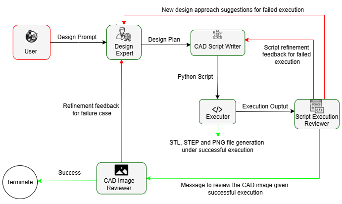

# MEDA
A multi-agent system for parametric CAD model creation



## Introduction
We propose MEDA - a multi-agent system (MAS) emulating the human like planning, coding, executing and reviewing for autonomous parametric CAD model generation by harnessing the coding, reasoning and multi-modal capabilities of MLLM (Multi-modal Large Language Model) like GPT-4o. In our architecture, _Design Expert_ plans the CAD modeling process reasoning upon the functions and methods available in the CadQuery library with appropriate positioning of features using coordinates and equations for poor spatial reasoning of the LLM. The _CAD Script Writer_ writes the Python Script based on the plan generated by the _Design Expert_. This code is executed by the _Executor_ which is powered by the local command line and provides execution logs to _Script Execution Reviewer_ for escalating _CAD Image Reviewer_ in case of successful execution or _CAD Script Writer_ (or _Design Expert_) in cas of execution failure. The _CAD Image Reviewer_ is powered by the MLLM through tool calling to evaluate the generated CAD based on the multimodal capability of the MLLM to analyse the image of the generated CAD.

## Demo


## Performance
We compare our multi-agent architecture MEDA with recent state-of-the-art CAD generation framework CADCodeVerify across three CAD evaluation metrics and compilation rate as shown in the table below.

**Table: Comparison of MEDA against CadCodeVerify**

| **Framework**     | **MLLM used** | **Point Cloud dist. ↓** | **Hausdorff dist. ↓** | **IoGT ↑**           | **Compile Rate ↑** |
|-------------------|---------------|--------------------------|------------------------|----------------------|---------------------|
| **MEDA**          | GPT-4o        | **0.0555** (0.095)       | **0.2628** (0.401)     | 0.9413 (0.0275)      | **99%**             |
| CADCodeVerify     | GPT-4         | 0.127 (0.135)            | 0.419 (0.356)          | **0.944** (0.028)    | 96.5%               |

## Setup Instructions

### 1. **Clone the Repository**
   ```bash
   git clone https://github.com/AnK-Accelerated-Komputing/MEDA.git
   cd MEDA
   ```
### 2. **Environment Setup**

1.  **Using Conda**

      ```bash
      conda env create -f environment.yml
      conda activate MEDA
      ```

2. **Using pip**

   ```bash
   python -m venv venv
   source venv/bin/activate  # On Windows use `venv\Scripts\activate`
   pip install -r requirements.txt
   ```

### 3. Common Steps for Both Environments

- Create a `.env` file in the root directory with the following content:
   
   ```
   GEMINI_API_KEY='your_gemini_api_key'
   GROQ_API_KEY='your_groq_api_key'
   AZURE_API_KEY='your_azure_api_key'
   AZURE_OPENAI_BASE='your_azure_openai_base_url'
   ```

- Alternatively, you can export them directly in your shell:

   ```bash
   export GEMINI_API_KEY='your_gemini_api_key'
   export GROQ_API_KEY='your_groq_api_key'
   export AZURE_API_KEY='your_azure_api_key'
   export AZURE_OPENAI_BASE='your_azure_openai_base_url'
   ```


### 4. **Run the Application**
- For command line application:
   ```bash
   python main.py
   ```
- For streamlit app:
   ```bash
   streamlit run streamlitapp.py
   ```
You can insert the api key for different models with streamlit app.
Then, follow the on-screen instructions to interact with MEDA.

## Paper
Our paper is accepted to IDETC 2025. More details to follow.
